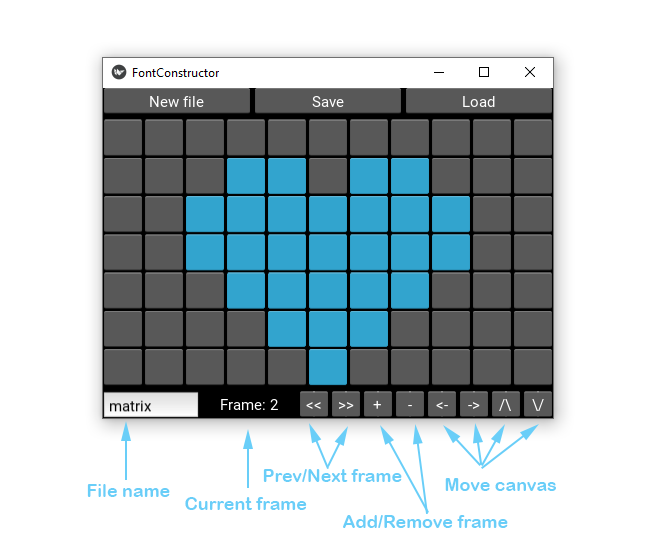
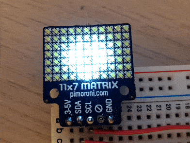

# font-generator
Useful tool for creating pixel fonts or animations for low density monochrome displays, like 
[11x7 matrix](https://shop.pimoroni.com/products/11x7-led-matrix-breakout) 
from Pimoroni.

Features:
- configurable matrix display size
- animated font
- optimized for animation

Requirements:
- Python 3

## Usage

### GUI explanation


### workflow
1. Create a new file with desired size by clicking "New file"
1. Draw a character or the first frame of animation bu clicking grey square glyphs in working area 
1. Click on "+" button to add new character/frame. Frame counter will display "Frame:2 ", but the contents of the 
frame will remain. This is done on purpose, because in most cases you would need a reference to a previous 
animation frame
1. Create new character/frame
1. Repeat steps 2-4 as many times as needed.
1. Save your work by clicking "Save". File will be saved under the name specified in the lower-left corner, with
extension .npy
1. Transfer your font/animation file to a RPi (or any other device capable of using numpy library for python)
1. Use the following example to display your font/frame

### how to use generated file on your device
```
import time
import numpy as np
from matrix11x7 import Matrix11x7

matrix11x7 = Matrix11x7()
matrix11x7.set_brightness(0.4)
m = np.load('anim.npy')

def show_img(img, display):
    for i in range(img.shape[0]):
        for j in range(img.shape[1]):
            display.set_pixel(j, i, img[i, j])
    display.show()

while True:
    for i in range(0, m.__len__()):
        show_img(m[i], matrix11x7)
        time.sleep(0.1)
```
Function `show_img()` takes approx. 61ms to run on RPi Zero for 11x7 display, so you can reach 15 fps for such a 
small screen.

### example
